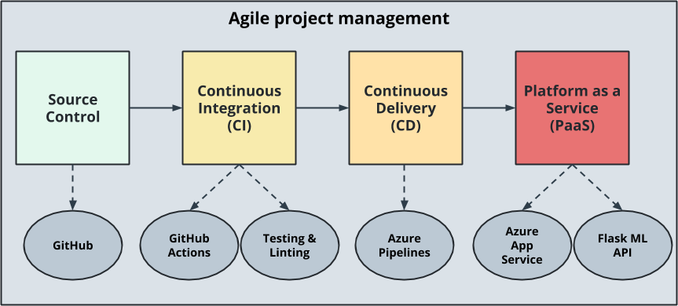

# Overview

In this project, you will build a Github repository from scratch and create a scaffolding that will assist you in performing both Continuous Integration and Continuous Delivery. You'll use Github Actions along with a Makefile, requirements.txt and application code to perform an initial lint, test, and install cycle. Next, you'll integrate this project with Azure Pipelines to enable Continuous Delivery to Azure App Service.

## Project Plan

- A link to a Trello board for the project:
  https://trello.com/b/2YFRCovT/udacity-project2
- A link to a spreadsheet that includes the original and final project plan>
  [original-paln](project_plan/original_plan.xlsx)
  [final_plan](project_plan/final_plan.xlsx)

## Instructions

- Architectural Diagram (Shows how key parts of the system work)>
  

<TODO: Instructions for running the Python project. How could a user with no context run this project without asking you for any help. Include screenshots with explicit steps to create that work. Be sure to at least include the following screenshots:

- Open Azure Cloud Shell

- Generate a ssh key

```bash
 ssh-keygen -t rsa
```

- View then copy key
  

- Add ssh key to github
  

- Running app locally

  - Clone repo in azure cloud shell
    
    

  - Setup Virtual Environment to run your application

  ```bash
  python3 -m venv ~/.flask-ml-service
  source ~/.flask-ml-service/bin/activate
  ```

  - Run make file to install dependencies

  ```bash
  make install
  ```

  - Run app locally

  ```bash
  python -m flask run
  ```

  

  - Launch a new Azure Cloud shell session and test the application by running the make_prediction.sh script then expect return prediction value

  ```bash
  ./make_prediction.sh
  ```

  

- Project running on Azure App Service

  - Create a new Resource Group for our app

  ```bash
  az group create --name "name" --location "location"
  ```

  - Deploy to app service in azure

  ```bash
  az webapp up --name "app-name" --resource-group "resource-group-name" --sku F1
  ```

  

  - Test app in browser
    

    - Azure app service from the Azure portal
      

- Project cloned into Azure Cloud Shell

- Passing tests that are displayed after running the `make all` command from the `Makefile`

- Output of a test run
  
- Successful deploy of the project in Azure Pipelines. [Note the official documentation should be referred to and double checked as you setup CI/CD](https://docs.microsoft.com/en-us/azure/devops/pipelines/ecosystems/python-webapp?view=azure-devops).

- Running Azure App Service from Azure Pipelines automatic deployment

- Successful prediction from deployed flask app in Azure Cloud Shell. [Use this file as a template for the deployed prediction](https://github.com/udacity/nd082-Azure-Cloud-DevOps-Starter-Code/blob/master/C2-AgileDevelopmentwithAzure/project/starter_files/flask-sklearn/make_predict_azure_app.sh).
  The output should look similar to this:

```bash
udacity@Azure:~$ ./make_predict_azure_app.sh
Port: 443
{"prediction":[20.35373177134412]}
```

- Output of streamed log files from deployed application

>

## Enhancements

<TODO: A short description of how to improve the project in the future>

## Demo

<TODO: Add link Screencast on YouTube>
